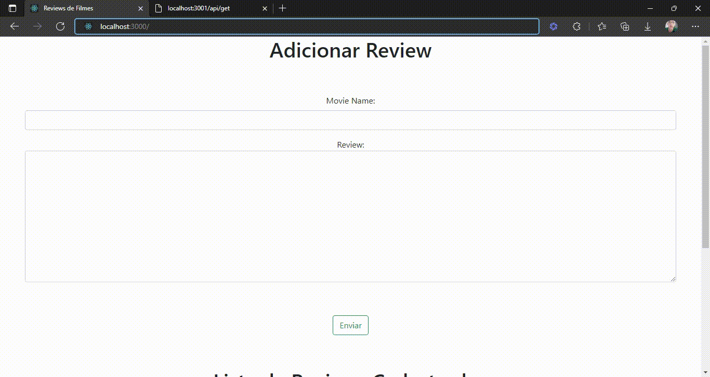

# react-crud
CRUD utilizando ReactJS, NodeJS, Express e MySQL.

## Tutorial Utilizado - Canal PedroTech
[Parte 1](https://www.youtube.com/watch?v=T8mqZZ0r-RA)

[Parte 2](https://www.youtube.com/watch?v=3YrOOia3-mo&list=WL&index=26)

[Parte 3](https://www.youtube.com/watch?v=S2GKnFpdtE)

## Front End finalizado
 

    
 

 

    
 
 
